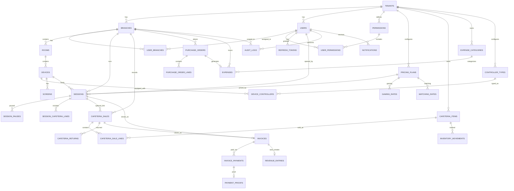

# PlayHub — Database Schema & ERD

> **Status:** Approved — decisions confirmed 2026-07-13.

---

## Entity Relationship Diagram



---

## Table Definitions

### Conventions

| Convention | Value |
|---|---|
| Primary keys | `uuid` (PostgreSQL `gen_random_uuid()`) |
| Timestamps | `timestamptz` (UTC) |
| Money | `numeric(18,2)` |
| Soft delete | `is_deleted`, `deleted_at`, `deleted_by_user_id` on financial entities |
| Auditing | `created_at`, `updated_at`, `created_by_user_id`, `updated_by_user_id` |

---

## 1. Tenancy & Identity

### `tenants`

| Column | Type | Notes |
|---|---|---|
| id | uuid PK | |
| name | varchar(200) | Shop/business name |
| slug | varchar(100) UNIQUE | URL-safe identifier |
| default_language | varchar(5) | `en` / `ar` |
| default_currency | varchar(3) | e.g. `EGP` |
| timezone | varchar(50) | e.g. `Africa/Cairo` |
| is_active | bool | |
| created_at | timestamptz | |

### `branches`

| Column | Type | Notes |
|---|---|---|
| id | uuid PK | |
| tenant_id | uuid FK → tenants | **Indexed** |
| name | varchar(200) | |
| address | text | nullable |
| phone | varchar(30) | nullable |
| is_active | bool | |
| created_at | timestamptz | |

### `users`

| Column | Type | Notes |
|---|---|---|
| id | uuid PK | |
| tenant_id | uuid FK → tenants | **Indexed** |
| email | varchar(256) | UNIQUE per tenant |
| password_hash | varchar(500) | |
| first_name | varchar(100) | |
| last_name | varchar(100) | |
| is_master | bool | Shop owner flag |
| preferred_language | varchar(5) | nullable → falls back to tenant default |
| is_active | bool | |
| last_login_at | timestamptz | nullable |
| created_at | timestamptz | |

> **Master user:** `is_master = true`. Created automatically on tenant registration. Has all permissions implicitly — no rows needed in `user_permissions`.

### `permissions`

System-wide permission catalog. Tenants can have custom permissions added in the future; seed with defaults.

| Column | Type | Notes |
|---|---|---|
| id | uuid PK | |
| code | varchar(100) UNIQUE | e.g. `Sessions.Create`, `Cafeteria.Sell` |
| module | varchar(50) | e.g. `Sessions`, `Cafeteria` |
| action | varchar(50) | e.g. `Create`, `Close`, `View` |
| description | varchar(500) | Human-readable |
| is_system | bool | true = seeded, false = tenant-custom |

**Seed permissions (extensible):**

```
Sessions.Create, Sessions.Pause, Sessions.Close, Sessions.View
Cafeteria.Sell, Cafeteria.Return, Cafeteria.View
Inventory.View, Inventory.Adjust
PurchaseOrders.Create, PurchaseOrders.Receive
Expenses.Add, Expenses.View
Reports.View
Assets.Manage
Settings.Manage
CanEditClosedRecords   ← special sensitive permission
```

### `user_permissions`

| Column | Type | Notes |
|---|---|---|
| user_id | uuid FK → users | PK composite |
| permission_id | uuid FK → permissions | PK composite |

### `user_branches`

| Column | Type | Notes |
|---|---|---|
| user_id | uuid FK → users | PK composite |
| branch_id | uuid FK → branches | PK composite |
| is_default | bool | Auto-select on login if single branch |

### `refresh_tokens`

| Column | Type | Notes |
|---|---|---|
| id | uuid PK | |
| user_id | uuid FK → users | |
| token_hash | varchar(500) | Store hash only |
| expires_at | timestamptz | |
| created_at | timestamptz | |
| revoked_at | timestamptz | nullable |
| replaced_by_token_id | uuid | nullable, rotation chain |

---

## 2. Asset Management

### `rooms`

| Column | Type | Notes |
|---|---|---|
| id | uuid PK | |
| tenant_id | uuid FK | |
| branch_id | uuid FK → branches | |
| name | varchar(100) | e.g. "Room 1", "VIP" |
| room_number | varchar(20) | nullable display number |
| max_watching_capacity | int | Max spectators (watching mode) |
| is_active | bool | |
| created_at | timestamptz | |

### `devices`

| Column | Type | Notes |
|---|---|---|
| id | uuid PK | |
| tenant_id | uuid FK | |
| branch_id | uuid FK → branches | |
| room_id | uuid FK → rooms | |
| identifier | varchar(50) | e.g. "PS5-A", "Station 3" |
| name | varchar(100) | Display name |
| is_active | bool | |
| created_at | timestamptz | |

> Live status (Idle / Gaming / Watching) is **derived at runtime** from open sessions, not stored — avoids sync issues. Cached in SignalR hub state.

### `controller_types`

Tenant-configurable controller classifications.

| Column | Type | Notes |
|---|---|---|
| id | uuid PK | |
| tenant_id | uuid FK | |
| name | varchar(100) | e.g. "4-Button", "5-Button", "Pro" |
| description | varchar(300) | nullable |
| is_active | bool | |

### `device_controllers`

| Column | Type | Notes |
|---|---|---|
| id | uuid PK | |
| device_id | uuid FK → devices | |
| controller_type_id | uuid FK → controller_types | |
| quantity | int | Number of this type on device |
| working_count | int | Functional controllers (≤ quantity) |

> **Max gaming players** = `SUM(working_count)` across all controller rows for the device.

### `screens`

| Column | Type | Notes |
|---|---|---|
| id | uuid PK | |
| device_id | uuid FK → devices | |
| count | int | Number of screens |
| working_count | int | Functional screens |
| notes | varchar(300) | nullable |

> Watching capacity = `rooms.max_watching_capacity` (screens are tracked for asset inventory, not pricing).

---

## 3. Pricing (Fully Dynamic per Tenant)

### `pricing_plans`

| Column | Type | Notes |
|---|---|---|
| id | uuid PK | |
| tenant_id | uuid FK | |
| branch_id | uuid FK → branches | **nullable** — null = tenant-wide default |
| name | varchar(200) | e.g. "Standard Gaming", "Match Day Watching" |
| session_mode | smallint | `1=Gaming`, `2=Watching` |
| time_unit | smallint | `1=PerMinute`, `2=PerHour` |
| is_active | bool | |
| created_at | timestamptz | |

### `gaming_rates`

One row per controller-count tier within a gaming plan.

| Column | Type | Notes |
|---|---|---|
| id | uuid PK | |
| pricing_plan_id | uuid FK → pricing_plans | |
| controller_count | int | e.g. 1, 2, 4 |
| rate | numeric(18,2) | Price per time unit for this tier |

**Example:** Plan "Standard Gaming" (per hour):
| controller_count | rate |
|---|---|
| 1 | 30.00 |
| 2 | 50.00 |
| 4 | 80.00 |

### `watching_rates`

| Column | Type | Notes |
|---|---|---|
| id | uuid PK | |
| pricing_plan_id | uuid FK → pricing_plans | |
| rate_per_person | numeric(18,2) | Price per person per time unit |

**Cost formula (watching):** `watcher_count × rate_per_person × elapsed_time_units`

### `device_pricing_plan` (optional override)

| Column | Type | Notes |
|---|---|---|
| device_id | uuid FK | PK composite |
| pricing_plan_id | uuid FK | PK composite |
| session_mode | smallint | PK composite |

> Allows VIP devices to use a different plan. Falls back to branch/tenant default if no override.

---

## 4. Sessions (Core)

### `sessions`

| Column | Type | Notes |
|---|---|---|
| id | uuid PK | |
| tenant_id | uuid FK | |
| branch_id | uuid FK → branches | |
| device_id | uuid FK → devices | |
| room_id | uuid FK → rooms | Denormalized for query speed |
| session_mode | smallint | `1=Gaming`, `2=Watching` |
| pricing_plan_id | uuid FK → pricing_plans | |
| controller_count | int | nullable — gaming only |
| watcher_count | int | nullable — watching only |
| rate_snapshot | jsonb | Locked rates at open time |
| status | smallint | `1=Open`, `2=Paused`, `3=Closed` |
| opened_by_user_id | uuid FK → users | |
| closed_by_user_id | uuid FK → users | nullable |
| started_at | timestamptz | |
| closed_at | timestamptz | nullable |
| total_paused_seconds | int | Accumulated pause duration |
| time_cost | numeric(18,2) | Calculated on close |
| cafeteria_cost | numeric(18,2) | Sum of session cafeteria lines |
| total_cost | numeric(18,2) | time_cost + cafeteria_cost |
| is_deleted | bool | Soft delete |
| deleted_at | timestamptz | |
| deleted_by_user_id | uuid FK | nullable |
| created_at | timestamptz | |

**Timer calculation on close:**
```
elapsed = (closed_at - started_at) - total_paused_seconds
time_units = ceil(elapsed / time_unit_duration)
gaming_cost = lookup_rate(controller_count) × time_units
watching_cost = watcher_count × rate_per_person × time_units
```

### `session_pauses`

| Column | Type | Notes |
|---|---|---|
| id | uuid PK | |
| session_id | uuid FK → sessions | |
| paused_at | timestamptz | |
| resumed_at | timestamptz | nullable |
| paused_by_user_id | uuid FK → users | |

### `session_cafeteria_lines`

Items added to an open session (billed on close).

| Column | Type | Notes |
|---|---|---|
| id | uuid PK | |
| session_id | uuid FK → sessions | |
| cafeteria_item_id | uuid FK → cafeteria_items | |
| quantity | int | |
| unit_price | numeric(18,2) | Snapshot at add time |
| line_total | numeric(18,2) | |
| added_by_user_id | uuid FK → users | |
| added_at | timestamptz | |

---

## 5. Cafeteria & Inventory

### `cafeteria_items`

| Column | Type | Notes |
|---|---|---|
| id | uuid PK | |
| tenant_id | uuid FK | |
| name | varchar(200) | |
| name_ar | varchar(200) | Arabic name |
| sell_price | numeric(18,2) | |
| current_quantity | int | Live stock count |
| min_threshold | int | Triggers Master notification |
| is_active | bool | |
| created_at | timestamptz | |

> Inventory is tracked per **tenant** (shared stock across branches) or per **branch** — **open question below**.

### `cafeteria_sales`

| Column | Type | Notes |
|---|---|---|
| id | uuid PK | |
| tenant_id | uuid FK | |
| branch_id | uuid FK → branches | |
| session_id | uuid FK → sessions | nullable — standalone if null |
| sold_by_user_id | uuid FK → users | |
| total_amount | numeric(18,2) | |
| status | smallint | `1=Completed`, `2=PartiallyReturned`, `3=FullyReturned` |
| sold_at | timestamptz | |
| is_deleted | bool | |

### `cafeteria_sale_lines`

| Column | Type | Notes |
|---|---|---|
| id | uuid PK | |
| sale_id | uuid FK → cafeteria_sales | |
| cafeteria_item_id | uuid FK → cafeteria_items | |
| quantity | int | Original qty sold |
| returned_quantity | int | default 0 |
| unit_price | numeric(18,2) | Snapshot |
| line_total | numeric(18,2) | |

### `cafeteria_returns`

| Column | Type | Notes |
|---|---|---|
| id | uuid PK | |
| sale_id | uuid FK → cafeteria_sales | |
| sale_line_id | uuid FK → cafeteria_sale_lines | |
| quantity | int | |
| reason | varchar(500) | Required |
| returned_by_user_id | uuid FK → users | |
| returned_at | timestamptz | |

> On return: decrement revenue (adjustment entry), restore inventory quantity, log audit.

### `inventory_movements`

Append-only ledger for every stock change.

| Column | Type | Notes |
|---|---|---|
| id | uuid PK | |
| tenant_id | uuid FK | |
| branch_id | uuid FK | nullable |
| cafeteria_item_id | uuid FK → cafeteria_items | |
| movement_type | smallint | `1=Sale`, `2=Return`, `3=PurchaseReceive`, `4=ManualAdjust`, `5=InitialStock` |
| quantity_change | int | Positive = in, negative = out |
| reference_type | varchar(50) | e.g. `CafeteriaSale`, `PurchaseOrder` |
| reference_id | uuid | |
| notes | varchar(500) | nullable |
| performed_by_user_id | uuid FK → users | |
| created_at | timestamptz | |

### `purchase_orders`

| Column | Type | Notes |
|---|---|---|
| id | uuid PK | |
| tenant_id | uuid FK | |
| branch_id | uuid FK → branches | |
| supplier_name | varchar(200) | nullable |
| status | smallint | `1=Draft`, `2=Ordered`, `3=Received`, `4=Cancelled` |
| total_cost | numeric(18,2) | |
| ordered_at | timestamptz | nullable |
| received_at | timestamptz | nullable |
| received_by_user_id | uuid FK → users | nullable |
| created_by_user_id | uuid FK → users | |
| created_at | timestamptz | |

### `purchase_order_lines`

| Column | Type | Notes |
|---|---|---|
| id | uuid PK | |
| purchase_order_id | uuid FK → purchase_orders | |
| cafeteria_item_id | uuid FK → cafeteria_items | |
| ordered_quantity | int | |
| received_quantity | int | default 0 |
| unit_cost | numeric(18,2) | Cost price |

> On receive: update `cafeteria_items.current_quantity`, create `inventory_movement`, auto-create `expense`.

---

## 6. Invoices & Payments

### `invoices`

Unified invoice for both session close and standalone cafeteria sale.

| Column | Type | Notes |
|---|---|---|
| id | uuid PK | |
| tenant_id | uuid FK | |
| branch_id | uuid FK → branches | |
| invoice_number | varchar(30) | Sequential per branch |
| invoice_type | smallint | `1=Session`, `2=Cafeteria` |
| session_id | uuid FK → sessions | nullable |
| cafeteria_sale_id | uuid FK → cafeteria_sales | nullable |
| subtotal | numeric(18,2) | |
| total | numeric(18,2) | |
| status | smallint | `1=Paid`, `2=Deferred`, `3=PartiallyPaid` |
| closed_by_user_id | uuid FK → users | |
| closed_at | timestamptz | |
| is_deleted | bool | Soft delete only |
| deleted_at | timestamptz | |
| deleted_by_user_id | uuid FK | nullable |
| created_at | timestamptz | |

### `invoice_payments`

| Column | Type | Notes |
|---|---|---|
| id | uuid PK | |
| invoice_id | uuid FK → invoices | |
| payment_method | smallint | `1=Cash`, `2=BankTransfer`, `3=DigitalWallet`, `4=Deferred` |
| amount | numeric(18,2) | |
| status | smallint | `1=Completed`, `2=PendingVerification`, `3=Deferred`, `4=Collected` |
| debtor_name | varchar(200) | Required if Deferred |
| debtor_phone | varchar(30) | nullable |
| collected_at | timestamptz | nullable |
| collection_method | smallint | nullable — method used when collected |
| collected_by_user_id | uuid FK → users | nullable |
| created_at | timestamptz | |

### `payment_proofs`

| Column | Type | Notes |
|---|---|---|
| id | uuid PK | |
| invoice_payment_id | uuid FK → invoice_payments | |
| file_url | varchar(500) | Azure Blob URL |
| file_name | varchar(300) | Original filename |
| content_type | varchar(100) | |
| uploaded_by_user_id | uuid FK → users | |
| uploaded_at | timestamptz | |

---

## 7. Accounting

### `revenue_entries`

Auto-created on invoice close — **no manual insert allowed**.

| Column | Type | Notes |
|---|---|---|
| id | uuid PK | |
| tenant_id | uuid FK | |
| branch_id | uuid FK → branches | |
| invoice_id | uuid FK → invoices | UNIQUE |
| amount | numeric(18,2) | |
| revenue_type | smallint | `1=Session`, `2=Cafeteria` |
| recorded_at | timestamptz | = invoice.closed_at |
| is_deleted | bool | |

### `expense_categories`

| Column | Type | Notes |
|---|---|---|
| id | uuid PK | |
| tenant_id | uuid FK | |
| name | varchar(200) | |
| name_ar | varchar(200) | |
| is_active | bool | |

### `expenses`

| Column | Type | Notes |
|---|---|---|
| id | uuid PK | |
| tenant_id | uuid FK | |
| branch_id | uuid FK → branches | |
| category_id | uuid FK → expense_categories | |
| purchase_order_id | uuid FK → purchase_orders | nullable — auto-linked |
| amount | numeric(18,2) | |
| description | varchar(500) | |
| expense_date | date | |
| recorded_by_user_id | uuid FK → users | |
| is_deleted | bool | |
| created_at | timestamptz | |

---

## 8. Audit & Notifications

### `audit_logs`

Append-only. **Never soft-deleted.**

| Column | Type | Notes |
|---|---|---|
| id | uuid PK | |
| tenant_id | uuid FK | |
| branch_id | uuid FK → branches | nullable |
| user_id | uuid FK → users | |
| user_name | varchar(200) | Denormalized snapshot |
| action_type | varchar(100) | e.g. `Session.Opened`, `Price.Updated` |
| entity_type | varchar(100) | e.g. `Session`, `Invoice` |
| entity_id | uuid | nullable |
| details | jsonb | Before/after values, extra context |
| ip_address | varchar(45) | |
| success | bool | false = denied attempt |
| timestamp | timestamptz | |

### `notifications`

| Column | Type | Notes |
|---|---|---|
| id | uuid PK | |
| tenant_id | uuid FK | |
| user_id | uuid FK → users | Master only for stock alerts |
| type | smallint | `1=LowStock`, `2=OverdueReceivable`, `3=SecurityAlert` |
| title | varchar(200) | |
| title_ar | varchar(200) | |
| message | text | |
| message_ar | text | |
| related_entity_type | varchar(100) | nullable |
| related_entity_id | uuid | nullable |
| is_read | bool | default false |
| created_at | timestamptz | |

---

## 9. Hangfire (Infrastructure)

Hangfire creates its own tables (`hangfire.*`) in the same PostgreSQL database. No custom schema needed.

**Scheduled jobs:**
| Job | Schedule | Action |
|---|---|---|
| `StaleSessionCleanup` | Every 30 min | Close sessions open > configurable max hours, alert Master |
| `LowStockCheck` | Every 15 min | Notify Master if `current_quantity ≤ min_threshold` |
| `OverdueReceivableCheck` | Daily | Notify Master of deferred payments > N days |
| `RefreshTokenCleanup` | Daily | Purge expired/revoked tokens |

---

## 10. EF Core Global Query Filter Pattern

```csharp
// Applied to every ITenantEntity
modelBuilder.Entity<T>().HasQueryFilter(e =>
    e.TenantId == _tenantProvider.TenantId && !e.IsDeleted);

// Applied to every IBranchEntity (when branch context is set)
modelBuilder.Entity<T>().HasQueryFilter(e =>
    e.TenantId == _tenantProvider.TenantId
    && e.BranchId == _branchProvider.BranchId
    && !e.IsDeleted);
```

Master users bypass branch filter when viewing cross-branch reports; branch filter is enforced on all operational mutations.

---

## Confirmed Decisions (2026-07-13)

| # | Decision |
|---|---|
| Q1 | Inventory is **per branch** — each branch tracks its own stock |
| Q2 | Time billing **rounds up** to the next whole unit — configurable per tenant via `tenants.billing_round_up` |
| Q3 | **Multiple active pricing plans** per mode — user selects at session open |
| Q4 | Deferred payments: **full collection only** for v1 |
| Q5 | Gaming price by **total controller count only** for v1 |
| Q6 | Invoice numbering is **per branch** with branch prefix |

---

## Entity Count Summary

| Domain | Tables |
|---|---|
| Tenancy & Auth | 6 |
| Assets | 5 |
| Pricing | 4 |
| Sessions | 3 |
| Cafeteria & Inventory | 7 |
| Invoices & Payments | 3 |
| Accounting | 3 |
| Audit & Notifications | 2 |
| **Total** | **33 custom tables** + Hangfire internals |

---

## Next Steps (After Your Approval)

1. ✅ You review this schema and answer open questions
2. Scaffold .NET 9 solution (`PlayHub.Api`, `PlayHub.Domain`, `PlayHub.Infrastructure`, `PlayHub.Application`)
3. EF Core migrations for all tables
4. Seed permissions + demo tenant
5. Auth module (register tenant, login, JWT, permissions middleware)
6. Swagger documentation
7. React frontend scaffold (incremental modules)
